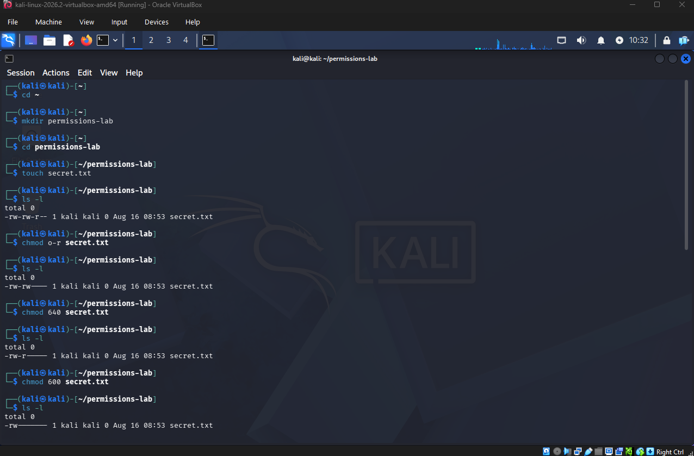

# Linux File Permissions Lab
## Overview
In this lab, I practiced Linux file permissions in my Kali Linux virtual machine. The goal here was to understand how Linux controls access to files using ownership, groups, and read, write, and execute permissions. Also, the main goal was to understand permissions from a security look.

I also practiced changing permissions with chmod, working with numeric permissions, and seeing how sudo affects access to protected areas of the operating system. 

## Lab Environment
 - Operating System: Kali Linux
 - Virtualization: Oracle VirtualBox
 - User Account: kali
 - Lab Directory: ~/permissions-lab

## Objectives
 - Understand Linux file permissions
 - Identify owner, group, and other permissions
 - Practice symbolic chmod commands
 - Practice numeric chmod permissions
 - Identify file ownership
 - Understand the difference between a normal user and root
 - Practice using sudo
 - Understand the Principle of Least Privilege

## Part One: Creating the Practice File
I created a directory for the lab and created a file named secret.txt using these commands. 
        
        cd ~
        mkdir permissions-lab
        cd permissions-lab
        touch secret.txt

Then to examine the file's permissions I used 

        ls -l

The original permissions were:

       -rw-r--r--

This meant:
 - Owner: had read and write permissions
 - Group: had read only permissions
 - Other: also had read only permissions

## Part Two: Removing Permissions
secret.txt was meant to represent a sensitive file for this lab. So therefore, I removed read permission from the other users. Using the following commands.

         chmod o-r secret.txt
         ls -l

I used the second line of command to verify the change. Resulting in a output of:

         -rw-r-----

I then also removed the group's read permission. Using the following command which also will show the result.

        chmod g-r secret.txt
        -rw-------

Now only the owner could read and write the file.

*Figure 1: Changing and verifying Linux file permissions using chmod.*

## Part Three: Numeric Permissions
I practiced setting permissions using numeric values. Linux permissions use the following values:
 - Read(r): 4
 - Write(w): 2
 - Execute(x): 1
 - None: 0

I set secret.txt to permission 640, which will alter earlier changes to allow the group to read the file.

         chmod 640 secret.txt
         ls -l
         -rw-r-----

I then changed the file back to permission 600. Which resulted in the group having no permissions like earlier, only allowing the owner to read and write the file. This prevents the group and other users from accessing the file.

## Part Four: Users, Groups, and Ownership
I used the following command to view the information about my current Linux user.

       id 

My Kali account had:

      UID: 1000 (kali)
      Primary GID: 1000 (kali)

I also examined secret.txt with:

      ls -l secret.txt

To determine the file was owned by the user kali and associated with the group kali. This helped me understand that Linux permissions work together with users, groups, and file ownership to determine who can access a resource.

## Part Five: Testing Root Permissions
I attempted to create a file inside the root user's home directory as my normal Kali user. Linux returned a Permission denied error because my normal user did not have permission to create files inside /root. Which led to me performing the second line of command with elevated privileges.

      touch /root/test.txt
      sudo touch /root/test.txt

I verified the file by using:

      sudo ls -l /root/test.txt

The file showed root root. Indicating that the file was owned by the root user and root group. After completing the test, I removed the practice file.

      sudo rm /root/test.txt

## Security Takeaways
This lab demonstrated why file permissions are important to cybersecurity. Giving users more access than they need can expose sensitive information or allow unauthorized changes. One of the most important concepts I took from this lab was Principle of Least Privilege. Users and Programs should only receive the permissions they need to perform their legitimate tasks.
For example, a sensitive file containing employee information should not use permissions such as -rwxrwxrwx. This would the give owner, group, and other users read, write, and execute permissions. A more appropriate permission would be for the owner to have only read and write permissions set.

## What I learned
This lab helped me understand how Linux uses users, groups, ownership, and permissions to control access to files. I learned how to read permission strings, change permissions using symbolic and numeric chmod commands, identify file ownership, and understand why some areas of Linux require elevated privileges.
I also learned that sudo should not simply be used whenever a command returns "permission denied". Before using elevated privileges, it is important to understand why access was denied and whether administrative privileges are actually necessary. 
