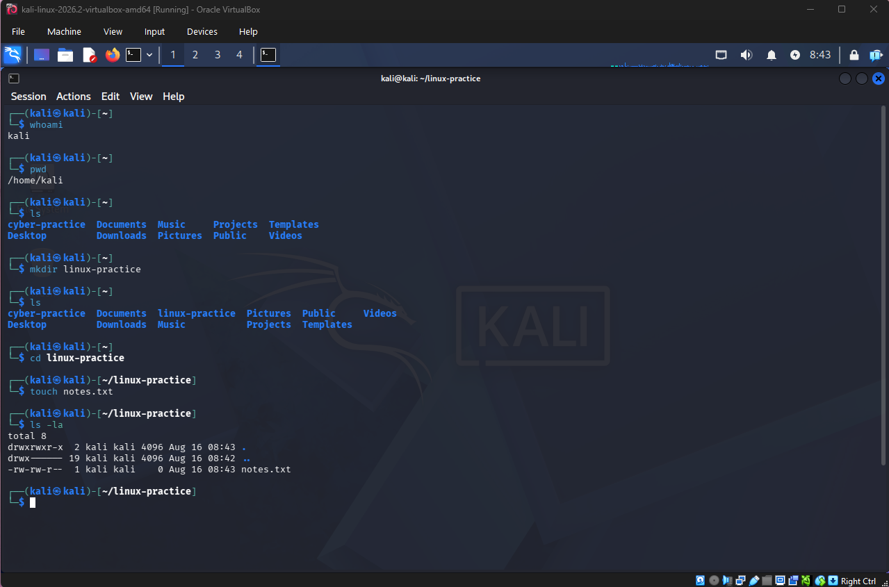

# Linux Basics
## Overview
This section captures the Linux fundamentals I have used in my Kali Linux home lab.

## Basic Commands
### whoami
**Purpose:** Displays the currently logged-in user.
### pwd
**Purpose:** Prints current working directory.
### ls
**Purpose:** lists files and directories.
### ls -la
**Purpose:** Displays a detailed list of files and directories, including hidden files.
### cd
**Purpose:** Changes current directory.
### mkdir
**Purpose:** Creates a new directory.
### touch
**Purpose:** Can create a new empty file. Command example: 'touch notes.txt'.
### nano
**Purpose:** Opens the Nano text editor. I used 'nano notes.txt' to also write a snippet on basic commands inside Kali Linux.
### cat
**Purpose:** Displays the contents of a file. 

*Figure 1: Practicing basic Linux filesystem and navigation commands in the Kali Linux terminal.*

## What I've learned and why it's important for cybersecurity. 
These might seem like the most basic Kali Linux commands however, they are important. Cybersecurity professionals need to understand the system they are working on. The whoami command identifies the current user, which matters because linux is multi-user operating system. Each user will have different permissions. The pwd commands shows your current location in the filesystem, which helps confirms where you are before working with files or running commands.

Commands such as ls and ls -la are useful in their own right. They allow us to examine files and directories. Using ls -la can also reveal hidden files and show file permissions, which can be important when investigating a system. The cd command allows us to move through the filesystem to locations containing logs, user files, and configuration files. 

Commands such as mkdir and touch allow files and directories to be made. While nano can be used to edit text files and configuration files. The cat command can allow us to quickly see into a file. 
