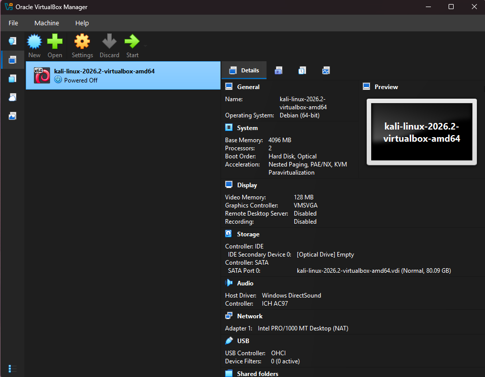
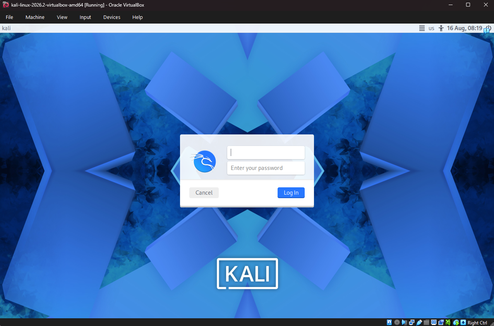

# Virtual Lab Setup
## Overview
Beginning out my project I created a virtual environment using Oracle VirtualBox and Kali Linux. The purpose of the virtual machine is to give me a separate environment where I can practice Linux and cybersecurity skills without installing Kali Linux directly on my Windows computer.

## Host Computer
My physical computer, which is my host, runs Windows 11.

Before creating the virtual machine, I checked my computers hardware to make sure it had enough resources to run both Windows and Kali Linux. 

## Installing VirtualBox
My first step was to visit Oracle's VirtualBox website and download the appropriate file for Windows and install. VirtualBox is a hypervisor which allows virtual machines to run on a physical computer. During installation, VirtualBox installed networking components that allow virtual machines to communicate through virtual network adapters.

## Installing Kali Linux
Instead of installing Kali Linux manually, I downloaded the official pre-built version VirtualBox image from Kali Linux's website. The download archive contained two important files. 
 - A VirtualBox machine configuration file (.vbox)
 -  A virtual disk image (.vdi)

The .vbox file contains configuration information for the virtual machine. While the other .vdi file acts as the virtual hard drive where the Kali Linux operating system and its files are stored.

## Adding Kali Linux to VirtualBox
After extracting the downloaded archive, I proceeded to open the .vbox file which adds Kali Linux straight into Oracle's VirtualBox. Before starting the virtual machine, I reviewed my computer's hardware setting, and altered Kali Linux's hardware settings for compatibility. 

VM Configuration 
 - Operating System: Kali Linux/ Debian 64-bit
 - Memory: I allocated 4GB of RAM while the virtual machine is active
 - Processors: 2
 - Virtual Disk: approx 80GB
 - Network Adapter: NAT

       
 *figure 1: Kali Linux virtual machine configuration in Oracle VirtualBox.*

 ## Understanding the Virtual Environment
 While my physical computer is the host machine, Kali Linux runs as the guest machine running inside VirtualBox.

 The basic setup looks like this:

             Physical Computer
                     |
                 Windows 11
                     |
                VirtualBox
                     |
                Kali Lunix

This allows Kali Linux to operate as its own computer while using hardware resources from the physical computer. 

## Networking
The Kali Linux machine is currently running on NAT (Network Address Translation) networking. This is the default setting; I plan on keeping while learning the fundamentals of Linux and virtualization. I plan to learn more about virtual networking and isolated lab networks as the project develops.

*Figure 2: Kali Linux successfully running as a virtual machine in Oracle VirtualBox.*

## What I've Learned
Setting up this lab helped me understand that a virtual machine is not another physical computer. It is a software-based computer that uses resources such as RAM, processor time, storage, and networking from the host computer. I also learned the difference between a host and a guest operating system and gained a basic understanding of how VirtualBox manages virtual hardware. This environment will be used throughout my cybersecurity home lab for Linux practice, networking exercises, security tools, and future cybersecurity labs.
