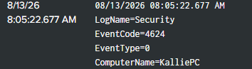
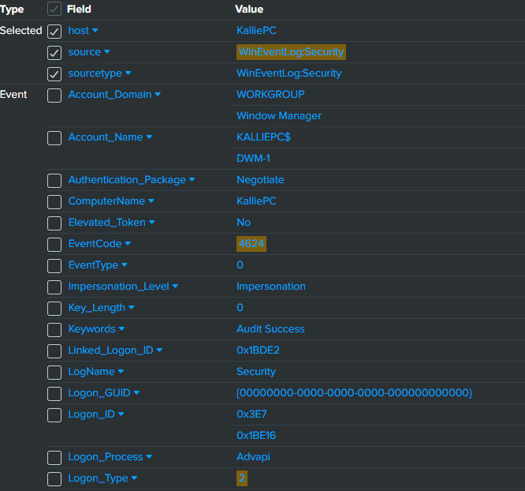

 
# Splunk SIEM Home Lab

## Project Overview
One of my focuses going into cybersecurity is potentially becoming a SOC analyst. That being said I knew I needed to start somewhere and develop hands-on skills with SIEM monitoring. Splunk was a tool that was talked about frequently when I was just obtaining my associate degree. 
So here I am today learning what all goes into SIEM monitoring with using Splunk as my tool. The types of logs I first started focusing on was successful logon attempts and failed logon attempts. Why? Because a story can take place behind those logs. Failed logon attempts can lead to investigations.

## Lab Environment
 - **Operating System:** Windows 11
 - **SIEM:** Splunk Enterprise
 - **Log Source:** Windows Security Event Logs
 - **Host:** Local Windows Computer

## What I did
First, I downloaded Splunk's enterprise. When first booting up this system it can be a little intimidating. I first into the settings Splunk provides and went into data input. Since I'm running this on my home computer I chose local event log collection. By editing this I then chose security to be added. Why? Security logs activity related to authentication attempts, account activity, privilege use, and other audited security events.
I was then able to make my first search for logs. I wanted to start out by using 4624 logs meaning successful login attempts. By using the search bar I a used a filter like the following:

             index=* source="WinEventingLog:Security" EventCode=4624

I used this based on the settings I had created earlier. Filtering down to just successful login attempts. I found an overwhelming number of logs and knew hardly anything about them. So, days of dedication to breaking down what all those scary words mean occurred. 
I reassured myself everything has a simpler meaning. Learning to breakdown each most important line within an event. Using the following event:

Let me break this down and explain why no further action was required for this event. The event code 4624 represents a successful logon. Going further and looking under account name, we can see the name of my computer but also DWM-1. DWM is associated with Windows, it is Window's Desktop Window Manager. DWM-1 plus logon type 2 plus local machine and successful authentication, and no other suspicious indicators consist with normal Windows activity. 
### Analyst Conclusion
Based on this information I came to the conclusion I would consider this normal activity and would not investigate further. The account involved is associated with Windows, the event was generated locally, and I did not find anything that suggested an unauthorized login. 
